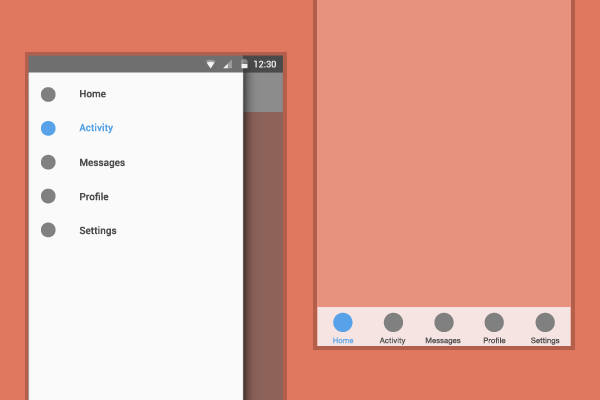

# React Native Again...


Download **Expo** from the Apple/Google Play Store to play along with the demo

---

* Problems with mobile development
* React Native - how does it work?
* Expo
* Demo

---

# Problems with mobile development

---

# Problem #1 - Fragmentation

Reaching 95% of mobile users involves developing for 2 platforms


---

# Problem #2 - Frameworks

First generation of cross-platform mobile frameworks suck

 


---

# Problem #2 cont...

They suck because:

* Web views have poor performance
* The promise of write-once-run-anywhere isn't a good fit for mobile


---


[Under the hood: Rebuilding Facebook for iOS](https://www.facebook.com/notes/facebook-engineering/under-the-hood-rebuilding-facebook-for-ios/10151036091753920/)

---

> "...while utilizing web technology has allowed us to support more than 500 million people using Facebook...people expect a fast, reliable experience and our iOS app was falling short..."

-- __Jonathan Dann__, Senior Facebook Engineer

---

# Problem #3 - Native == $$$

Native app development is expensive:

* Developers need to know 2 languages
* Platform APIs are not aligned
* Design guidelines for Android/iOS are different

---



---

# React Native

* _Learn_ once write anywhere
* Native performace in Javascript
* Supports iOS, Android
* Apple TV, Windows Phone, OSX support coming soon
* Live updates

---

# How does it work?

Javascript core communicates with native APIs via the 'bridge'

The bridge helps us communicate with the native code by marshalling types, setting properties and passing events back to our Javascript

---

# Initialising native code

* Implement a subclass of `RCTViewManager` which does most of the work
* Add a macro `RCT_EXPORT_MODULE()`
* Implement a method `-(UIView *)view` - returning an instance of the native class

---

# Calling native code from JS

In your javascript, simply import this new (MyClass) class...

    // MyComponent.js

    import { requireNativeComponent } from 'react-native';

    // requireNativeComponent automatically resolves this to "RNTMyClassManager"
    module.exports = requireNativeComponent('RNTMyClass', null);

---

# Setting data on a native component via props

Native - `RNTMyClass.m`

```objectivec 
RCT_EXPORT_VIEW_PROPERTY(awesomeEnabled, BOOL)
```

Javascript - `MyComponent.js`

```javascript
<MyClass awesomeEnabled={true} />
```

---

# Document your props

```javascript
MapView.propTypes = {
  /**
   * When this property is set to `true` awesomeness is enabled
   */
  awesomeEnabled: React.PropTypes.bool,
};
```

---

More complex setters require conversion functions to modify raw JSON into native objects before assigning to class properties

---

# Receiving events back from a native component

```objectivec
// RNTMyClass.h
@property (nonatomic, copy) RCTBubblingEventBlock onChange;

// RNTMyClassManager.h
RCT_EXPORT_VIEW_PROPERTY(onChange, RCTBubblingEventBlock)

// implement callback

- (void)awesomeView:(RNTAwesome *)awesomeView awesomenessDidChange:(BOOL)awesome
{
  // check callback set, if not return
  if (!awesomeView.onChange) {
    return;
  }

  awesomeView.onChange(@{
    @"awesome": @(awesome)
  });

```

---

# Receiving events cont...

```javascript
class AwesomeView extends React.Component {
  constructor() {
    this._onChange = this._onChange.bind(this);
  }
  _onChange(event: Event) {
    console.log(event.nativeEvent.awesome);
  }
  render() {
    return <RNTAwesome onChange={this._onChange} />;
  }
}
```

---

# Expo

* React Native framework that helps you get up and running quickly
* Prototype ideas and share with your team/friends
* Pre-defined components (Facebook/Google login, Image Picker, Permissions)
* Web IDE (Snack - https://snack.expo.io)

---

# Demo

* [https://snack.expo.io/BJkDa_XGW](https://snack.expo.io/BksukY7GZ)


---

# So something went wrong...


